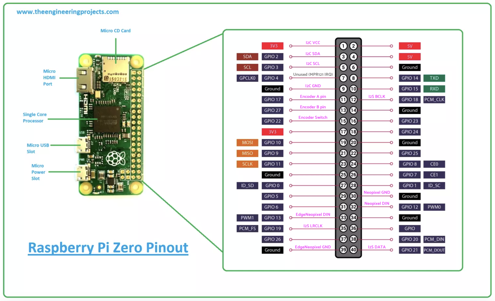

# Drum Sick - 8-step drum sequencer

A drum sequencer meant to be straight forward to use as to function as a kid's toy, but fun and versatile enough as to be fun for a parent.

It features: 8 steps for 3 instruments (kick, snare, hihat), multiple sound banks, a distortion effect, various time signatures, volume and tempo control. In my hardware implementation, all the steps are laid out in 3 rows and backlit.

# Setup

### 1. Flash Raspberry Pi OS Lite (64-bit)

### 2. Configure I2S

Add line to `/boot/firmware/config.txt`:

```
dtoverlay=hifiberry-dac
```

This configures the I2S pins (BCM 18, 19, 21 for BCLK, LRCLK, DATA).

### 3. Install dependencies

```
sudo apt update
sudo apt install pip git
sudo apt install i2c-tools  # optional but useful

# Avoid having to use a venv
sudo rm /usr/lib/python3.13/EXTERNALLY-MANAGED

sudo apt install python3-numpy
sudo apt install libportaudio2

git clone https://github.com/iuliux/drum-machine-rpizero.git
cd drum-machine-rpizero/
sudo pip install -r requirements.txt --break-system-packages
```

### 4. Run (and update) on startup

```
chmod +x /home/pi/drum-machine-rpizero/scripts/setup-service.sh
sudo sh /home/pi/drum-machine-rpizero/scripts/setup-service.sh
```

### 5. System optimizations

```
# Disable Bluetooth
sudo systemctl disable bluetooth
sudo systemctl stop bluetooth

# More to disable (to maybe improve boot time)
sudo systemctl disable ModemManager

# Disable all cloud-init services
sudo touch /etc/cloud/cloud-init.disabled

# Reduce swappiness
sudo sysctl vm.swappiness=10

# CPU performance mode
echo performance | sudo tee /sys/devices/system/cpu/cpu*/cpufreq/scaling_governor
```

## Utils

### Check I2C devices:

```
sudo i2cdetect -y 1
```

### Stop the service loaded at boot:

```
sudo systemctl stop drummachine
```

### Manual run over SSH:

```
cd /home/pi/drum-machine-rpizero
sudo python drummachine.py
```

# Hardware

### Components:

- Raspberry Pi Zero 2 W
- PCM5102A I2S DAC
- KY-040 Rotary Encoder
- 2.4" 128x64 OLED Display Module (SSD1309)
- MPR121 12-Button Capacitive Touch Sensor (2 of them)
- 24 x WS2812b LEDs (on a 30 LEDs/m strip, cut in 3 pieces of 8 LEDs)
- 8 x WS2812b LEDs on a 5mm wide strip (optional, for edge lighting)
- TDA2030 Power Amp Module
- 52mm 5W 4ohm Round Full-frequency Speaker
- Power management:
    - 3S BMS (3 Li-Ion cells giving clean almost-12V for the power amp)
    - MP1584 buck converter (with extra large capacitors added)
    - LM317t linear step-down converter (to get cleaner 5V for the DAC)

### Pinout:

#### I2S Audio DAC (PCM5102A):
```
GPIO 18 (Pin 12) - BCLK (Bit Clock) - Not manually configured (I2S controlled)
GPIO 19 (Pin 35) - LRCLK (Left/Right Clock)
GPIO 21 (Pin 40) - DATA (Serial Data)
```

#### I2C Bus (for MPR121 touch sensors and OLED display):
```
GPIO 2 (Pin 3) - SDA (I2C Data)
GPIO 3 (Pin 5) - SCL (I2C Clock)
```

#### Rotary Encoder:
```
GPIO 17 (Pin 11) - CLK (A pin)
GPIO 27 (Pin 13) - DT (B pin)
GPIO 22 (Pin 15) - Switch (push button)
```

#### NeoPixel LED Strips:
```
GPIO 12 (Pin 32) - Main LED strip (PWM0)
GPIO 13 (Pin 33) - Step indicator strip (PWM1)
```

#### Touch Sensors IRQs (MPR121) -- UNUSED:
```
GPIO 4 (Pin 7) - MPR121 Sensor 1 IRQ
GPIO 5 (Pin 29) - MPR121 Sensor 2 IRQ
```



---

## Totally optional: Boot time splash screen


1. Compile the C splash program

```
gcc -O3 oledsplash.c -static -o oledsplash
```

2. This script runs during update-initramfs and copies the binary into the RAM disk.

```
sudo nano /etc/initramfs-tools/hooks/oledsplash_hook
```

Add:

```
#!/bin/sh
PREREQ=""
prereqs() {
    echo "$PREREQ"
}
case $1 in
prereqs)
    prereqs
    exit 0
    ;;
esac

. /usr/share/initramfs-tools/hook-functions

# Copy the binary from your project dir to the initramfs /bin/
copy_exec /home/pi/drum-machine-rpizero/oledsplash /bin/
```

3. This is the actual script that runs during boot, calling your binary.

```
sudo nano /etc/initramfs-tools/scripts/init-top/oledsplash_exec
```

Add:

```
#!/bin/sh
PREREQ=""
prereqs() {
    echo "$PREREQ"
}
case $1 in
prereqs)
    prereqs
    exit 0
    ;;
esac

# Load i2c modules explicitly
modprobe i2c-dev
modprobe i2c-bcm2835

# Give the kernel a moment to create the device node
sleep 0.5

# Manually create the device node if udev hasn't run yet
[ -e /dev/i2c-1 ] || mknod /dev/i2c-1 c 89 1

# Execute our binary from the initramfs /bin/
exec >> /run/oledsplash.log 2>&1
echo "oledsplash_exec started at $(date)"
ls -la /dev/i2c* || echo "No i2c devices found"
modprobe i2c-dev && echo "i2c-dev loaded" || echo "i2c-dev FAILED"
/bin/oledsplash && echo "oledsplash OK" || echo "oledsplash FAILED: $?"
```

Make them both executable:

```
sudo chmod +x /etc/initramfs-tools/hooks/oledsplash_hook
sudo chmod +x /etc/initramfs-tools/scripts/init-top/oledsplash_exec
```

4. The initramfs must have the I2C kernel module loaded:

```
echo "i2c-dev" | sudo tee -a /etc/initramfs-tools/modules
echo "i2c-bcm2835" | sudo tee -a /etc/initramfs-tools/modules
```

5. Regenerate the images:

```
sudo update-initramfs -u
```

6. Edit `config.txt`.

```
sudo nano /boot/firmware/config.txt
```

Below `auto_initramfs=1`, add:

```
# Explicitly point to the files generated by update-initramfs
initramfs initramfs8 followkernel
```
